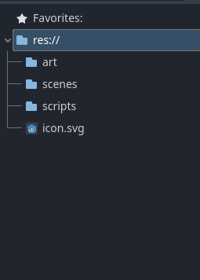
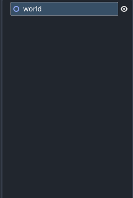
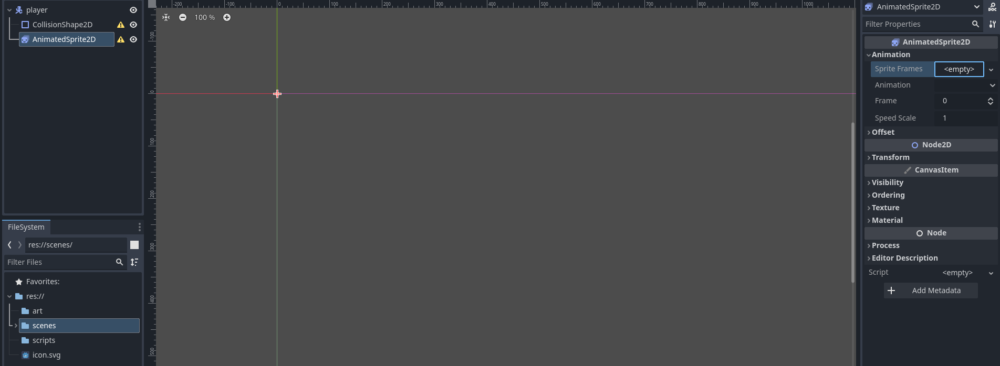
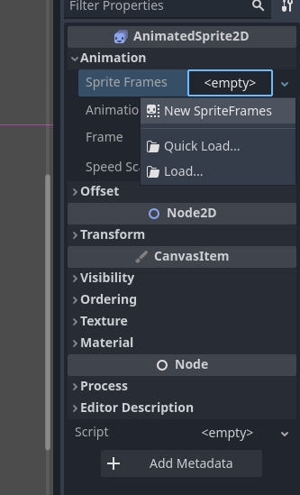
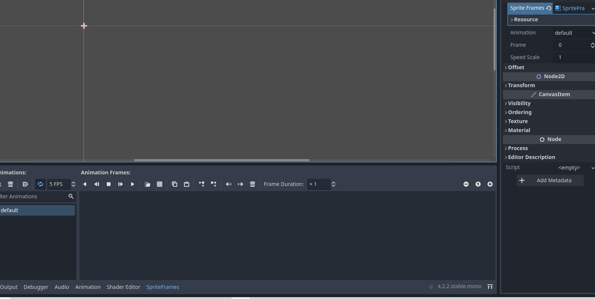
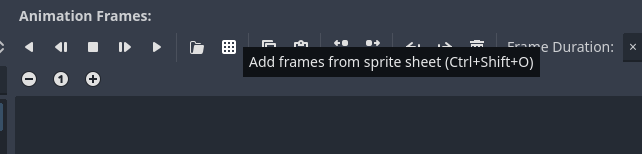
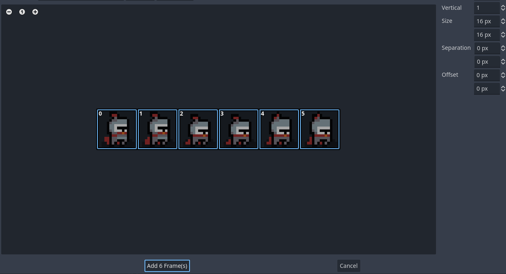
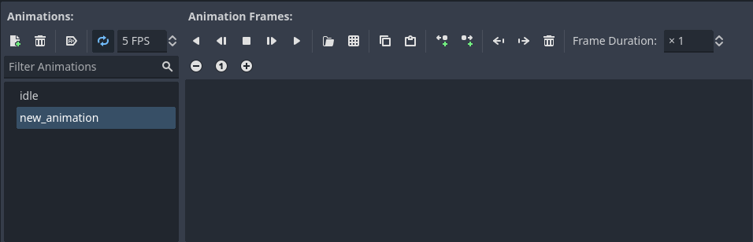
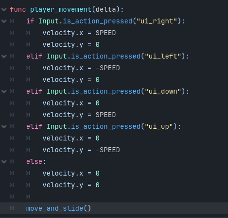
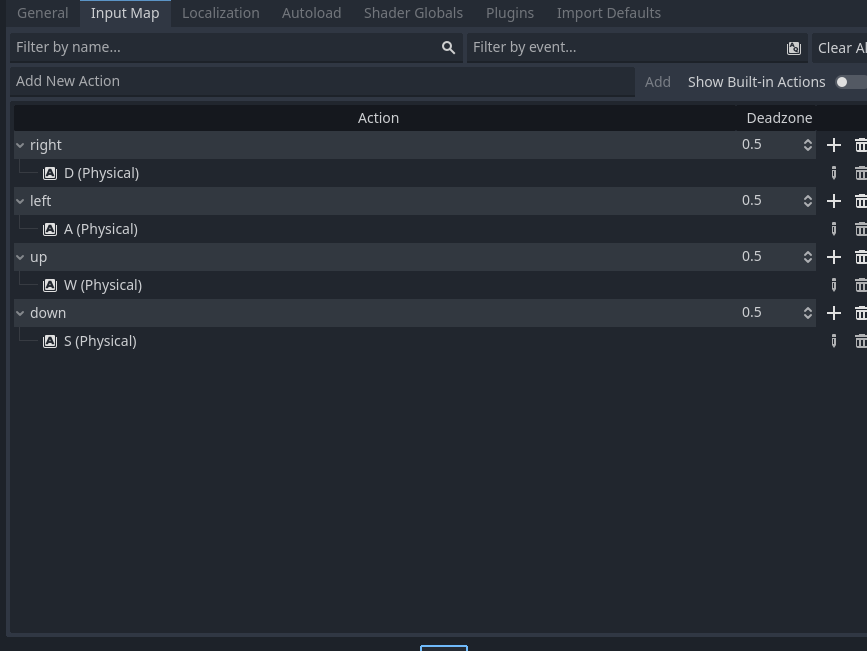

# godot_project_nada_jason

Duty

1: find assets
2: create system design
3: animation
4: mapping
5: basic script (movement, attack, HUD)

Thu 2 May

Once you started the project, It is a good practice to organise your files.

Now create a 2D scene, name it world, then save it to scenes folder.

CREATING A PLAYER

now create another scene, select the other node, and select CharacterBody2D, name it player.

tip : note that if you crate CharacterBody2D scene, you need to attach 2d collision node, AnimatedSprite2D

Click animatedSprite2D and go to Sprite Frames

click this and import assets.

Match the grid.

Now to make the player character more clearly 

You need to go to project - project settings - rendering - textures - Default Texture Filter to Nearest.

now lets add more.

Challenge add more animation based on the assets you've been given. 

now that you've created all the animation,

create  a script for player scene.

create two functions 

one _phtsics_process

two player_movement

create a variable named SPEED and give value to it.

and make sure to call move_and_slide() built in function.

You can also change the input map under project setting.

